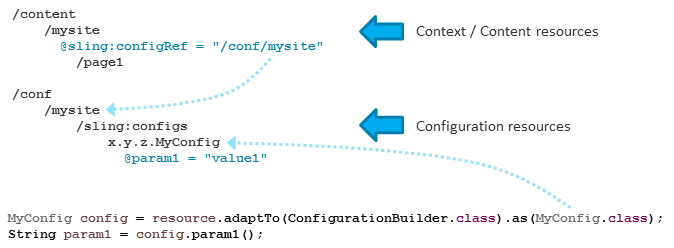
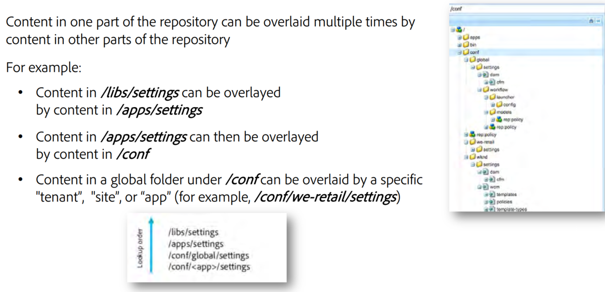

# Apache Sling Context Aware Configuration

 ~~~
Resource contentResource = resourceResolver.getResource("/content/mysite/page1");
 
 
Resource configResource = configurationResourceResolver.getResource(contentResource, "my-bucket", "my-config");
Collection<Resource> configResources = configurationResourceResolver.getResourceCollection(contentResource, "my-bucket", "my-config");
 ~~~

### sling:configRef - property set defines the root resource of a context

  
  If you define nested contexts or use a deeper hierarchy of resourced in /conf the inheritance rules are applied. Additionally it is possible to define default values as fallback if no configuration resource exists yet in /conf.
  
### Overlaid

### Annotation

 ~~~
 @Configuration(label="My Configuration", description="Describe me")
public @interface MyConfig {

    @Property(label="Parameter #1", description="Describe me")
    String param1();

    @Property(label="Parameter with Default value", description="Describe me")
    String paramWithDefault() default "defValue";

    @Property(label="Integer parameter", description="Describe me")
    int intParam();
}
 ~~~

If you provide your own configuration annotation classes in your bundle, you have to export them and list all class names in a bundle header named Sling-ContextAware-Configuration-Classes.
example: Sling-ContextAware-Configuration-Classes: x.y.z.MyConfig, x.y.z.MyConfig2

### HTL - caconfig

 ~~~
 <dl>
    <dt>stringParam:</dt>
    <dd>${caconfig['x.y.z.ConfigSample'].stringParam}</dd>
</dl>
 ~~~

 ~~~
<ul data-sly-list.item="${caconfig['x.y.z.ConfigSampleList']}">
    <li>stringParam: ${item.stringParam}</li>
</ul>
 ~~~

access nested configurations, you have to use a slash "/" as a separator in the config name.
 ~~~
${caconfig['x.y.z.ConfigSample/nestedConfig'].stringParam}
 ~~~

links:
 - https://sling.apache.org/documentation/bundles/context-aware-configuration/context-aware-configuration-default-implementation.html
 - 