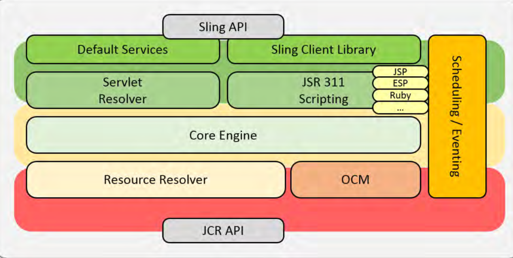

### Apache Sling

## URL Decomposition

http://localhost/content/portal/page.selector.xy.html/a/b?par=12

 - path = /content/portal/page
 - selectors = selector, xy
 - extension = html
 - suffix = a/b
 - requestParams = par=12

## Order

 - selector.xy.html
 - selector.html
 - xy.html
 - (name of component).html
 - method.html