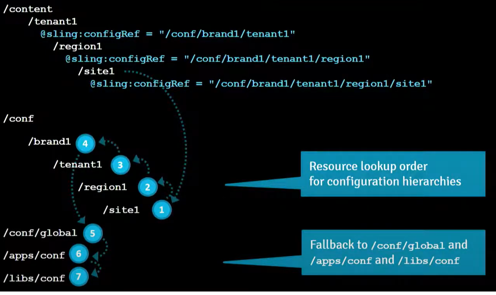
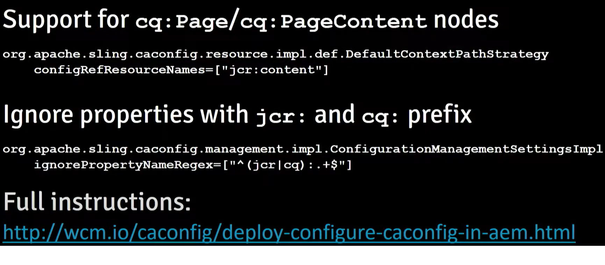
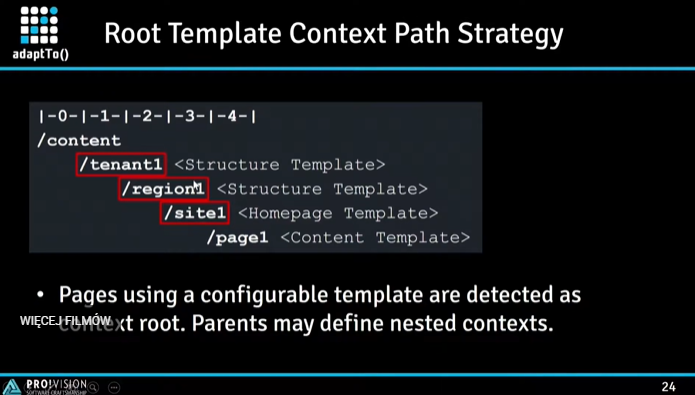
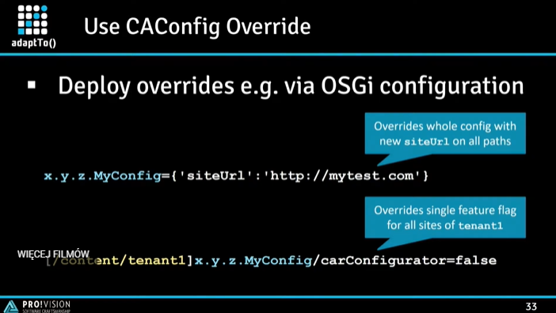

## wcm.io - Libraries and extensions for AEM applications

- wcm.io is a collection of independent modules which can be used standalone or in combination.

    - WCM
      - Core Components - Enhances AEM Sites Core Components with wcm.io functionality.
      - Parsys
      - Commons - Common WCM utility and helper functions.
        - adoptTo 
      - Granite UI Extensions: Granite UI Components for AEM Touch UI.
      - Clientlibs UI Extensions: Extensions for AEM HTML client libraries.
      - WCM Mock Helper: Helps setting up mock environment for wcm.io WCM Commons.
    
- Context-Aware Configuration
  
  Configuration that are related to a content resource or a resource tree (tenant,region,site)
  
  
  
    definition: sling:contentRef property on each root page pointing to path at /conf

  

    define a rule how to match config path to content path:

     - contextPathRegex     = "^/content(/.+)$"  
     - configPathPatterns   = \["/conf$1"\]
     - Context root path    = /content/tenant/region/site
     - Derived config path  = /conf/tenant/region/site
  
  Use Cases:
     
     - "externalization" base URLs for each site e.g. siteUrl = "http://mydomail.com"
     - feature flag e.g. carConfigurator = true | false

    

   - Editor:  Configuration Editor Template for AEM.
   - Extensions: AEM-specific extensions for Sling Context-Aware Configuration.

[wcm.io AEM Context-Aware Configuration training material](https://training.wcm.io/caconfig/)
[adaptTo() 2016 Talk: Sling Context-Aware Configuration](https://adapt.to/2016/en/schedule/sling-context-aware-configuration.html)
[adaptTo() 2017 Talk: Context-Aware Configuration in AEM](https://adapt.to/2016/en/schedule/sling-context-aware-configuration.html)

- Handler
- Sling Extension
- Site API
- Testing
- Samples
- Tooling

* links

> https://wcm.io/